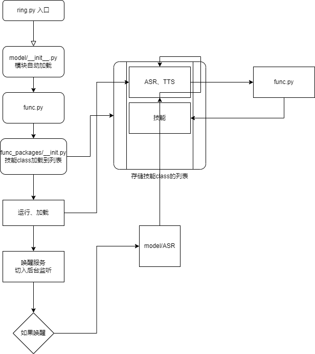

# 卸载

删除 ~/ringrobotx/ 目录即可

# 关于码风

如果你深入研究这个项目的话，你会发现可能读不通

因为发起者折腾是个~~山东糙汉~~码风比较奇怪

比如：他从来不喜欢写class和注释，只要没必要写class的地方尽量不写class

再有一个，折腾是个OI生，所以他的变量里面的英语单词很奇怪，比如“updown”是指连续对话，path1，patha，namea，name3等等

善用搜索功能，您会读懂这个的！

# 提问的技巧

当是因为我们软件错误时，您需要附上程序输出的报错内容（亦或屏幕截图

如果不是，那么你需要做好心理准备，因为这不是我们的错，我们没有这个义务，如果有人回答时，那么他绝对是好心提醒你。你可以先尝试搜索解决问题

当然，想象我是你对面那个人，想象你我相等，然后提出问题，保证你的问题没有居高临下的口气和强迫的口吻，并且你的问题能够一眼就能告诉开发人员问题出在哪里（有错误触发过程，日志），你的问题能够更快地获得解答，也是一个好问题必须有的。

如果你没有遵守，很抱歉，我们无法很快地定位问题所在，你的问题可能需要一段时间才能被发现/找到/修复。

如果你对这一段文字感兴趣，可以阅读《提问的技巧》

# 我还是看不懂Wiki，不知道怎么写技能包，怎么办！！！

很简单，你去看看仓库的func_packages文件夹，看看仓库自带的技能包是如何实现的，然后照着葫芦画瓢实现一个，就OK了

如果你还是不懂，那么说明这个项目就是失败的，因为本项目本来就是为了减少机器人的开发难度而设计的

有不懂的问题大胆提，或者直接私信找本仓库的负责人，他如果能看到，会耐心给你解答的 :wink: 

# 它到底是怎么运行的？？？

就是这样，整个系统保证着完全可控、高自定义性、操作简单的特点。